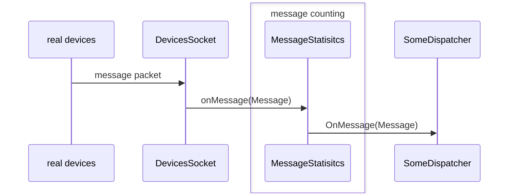
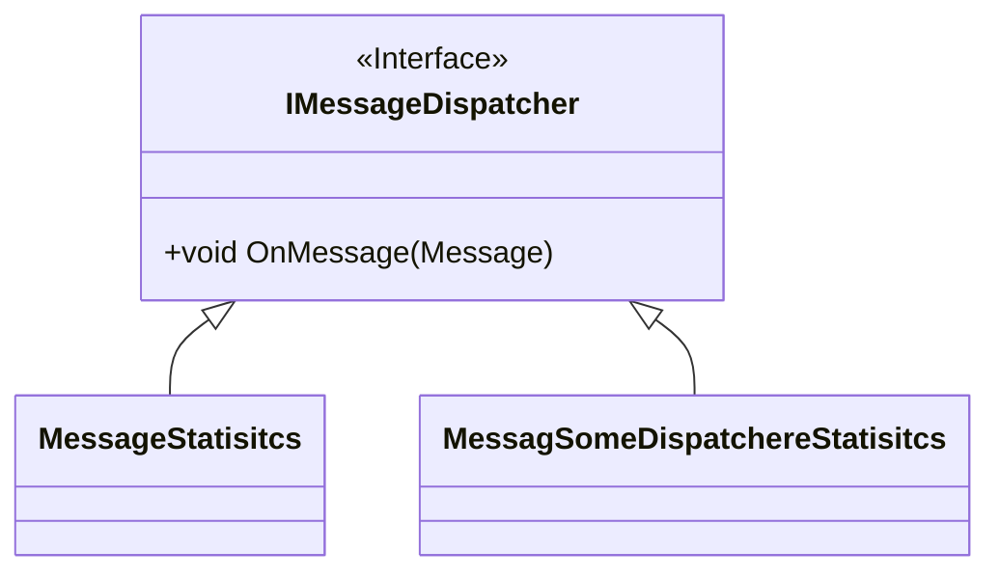

# Project
The problem to solve is following:  
                You monitor devices, which are sending data to you.
                Each device has a unique name.
                Each device produces measurements.

Challange is:  
                Compute number of messages you got or read from the devices.

# Solution
## Assumption
_DevicesSocket_ stub class provides routine to read messges from device, pack them into a _Message_ structure, and call a _IMessageDispatcher::onMessage_ to request message processing. Exact mechanism of transmission of orignal messages is ignored - all logic to gather, concat and format incoming messages is responsibility of _DevicesSocket_. Here I silently assumed is some kind of socket.
## Design
Solution proposes a design that consist of _IMessageDispatcher_ interface decorator that:
1. compute statistics on messages, in our case it is a number of messages processed,
2. forward the message to c-tor injected _IMessageDispatcher_ for further processing.

# How to build & run
CMakeLists.txt with two targets: _eht_, _eht_GT_ is provided.  
Run:  
`cmake`  
to generate makefiles.  
Run:  
`cmake --build .`  
to generate all binaries.  
Run:  
`cmake --build . --target eht_GT`  
to generate test binaries only.  
Run:  
`./eht_GT`  
to execute tests.  
_eht_ binary is just a stub.